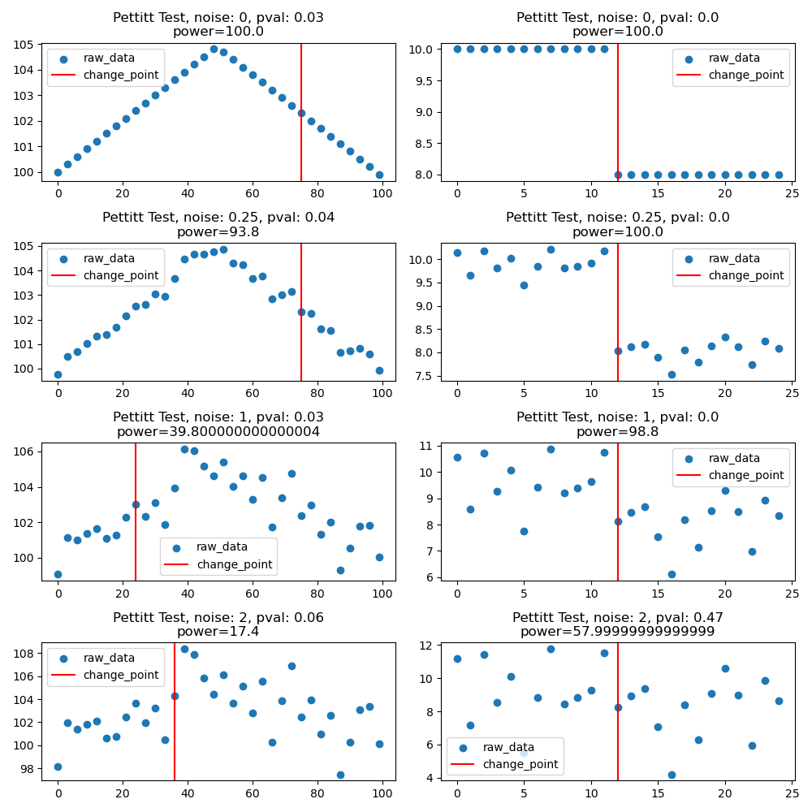
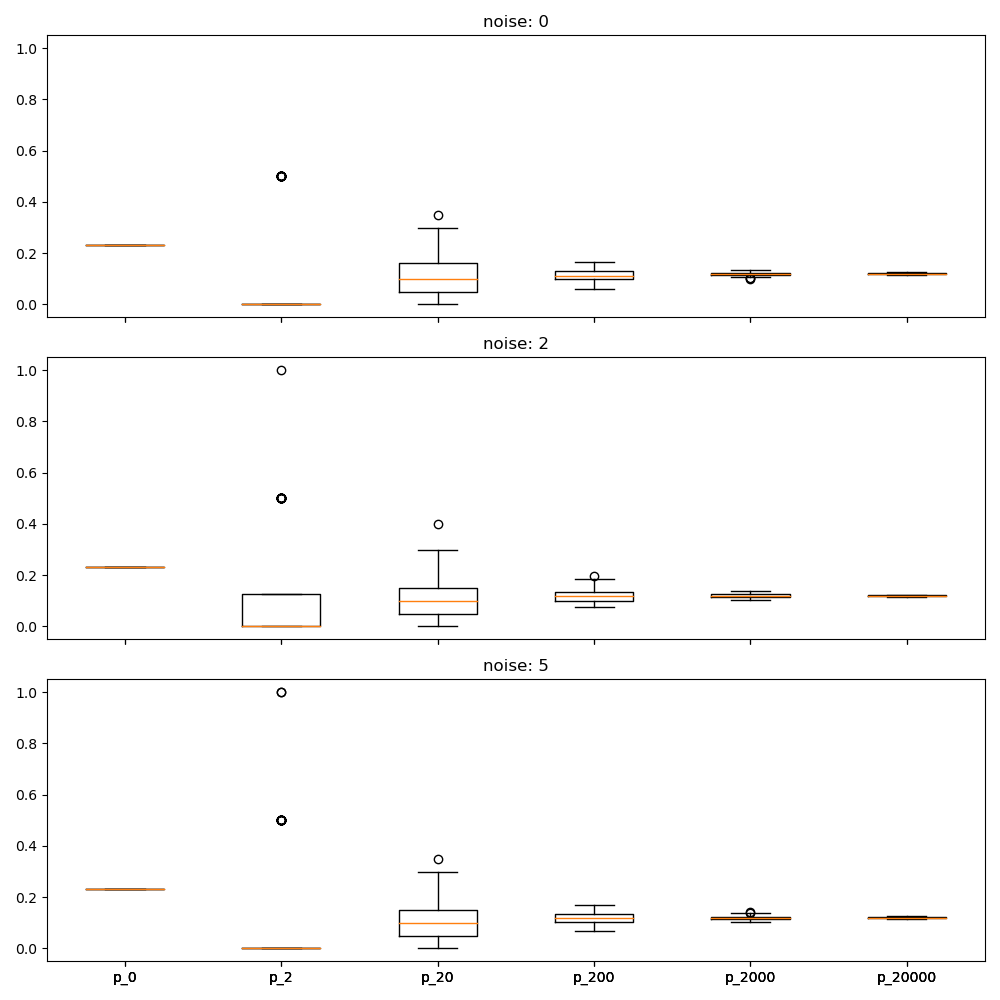
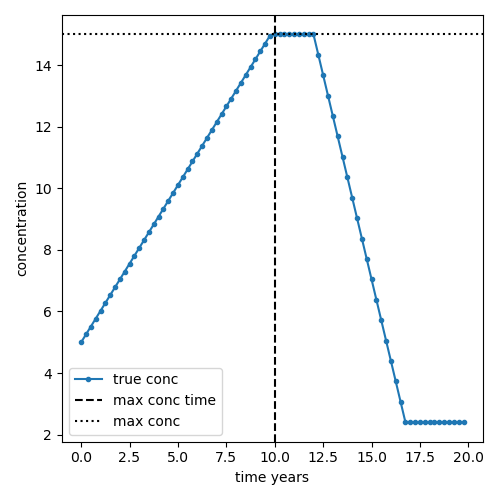
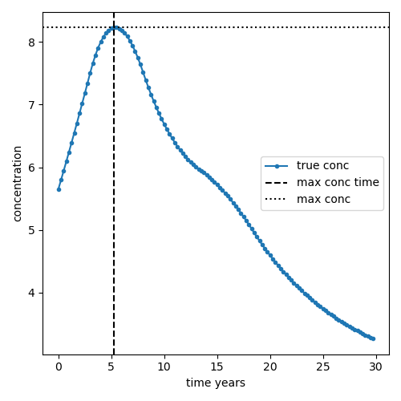
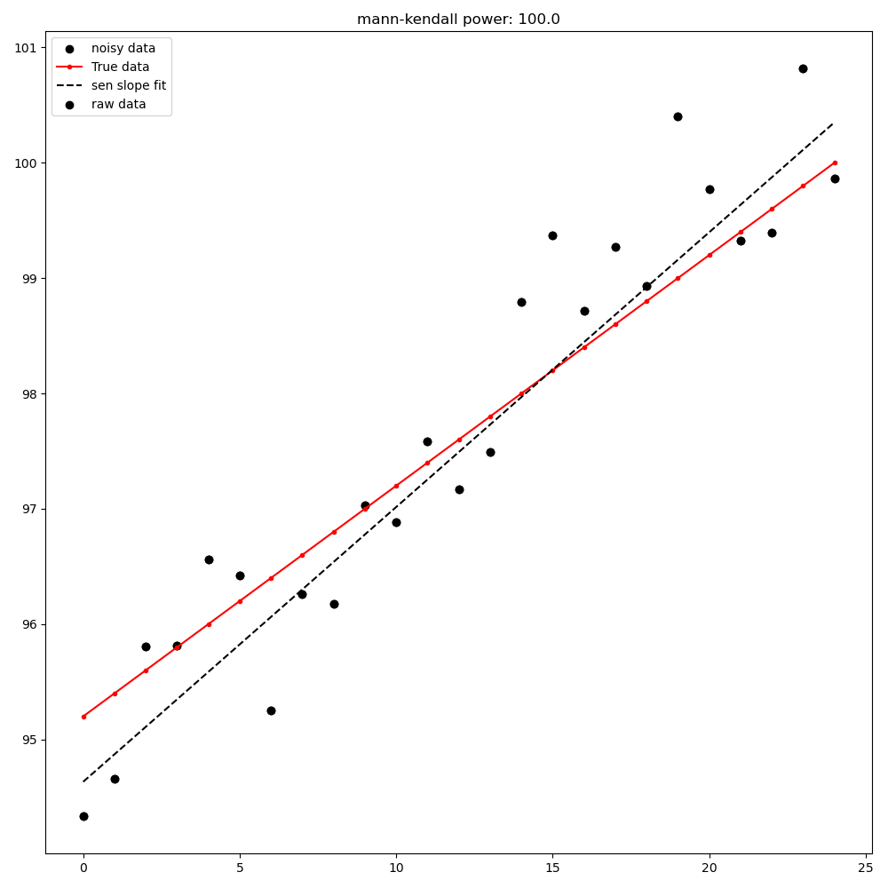
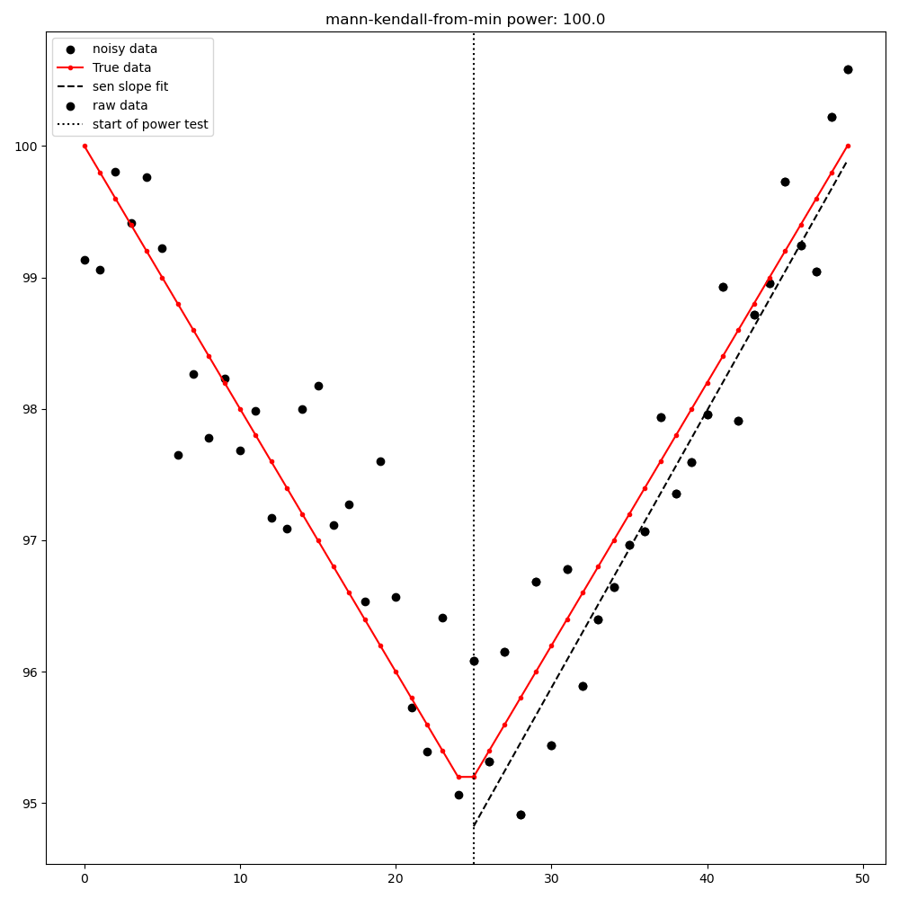
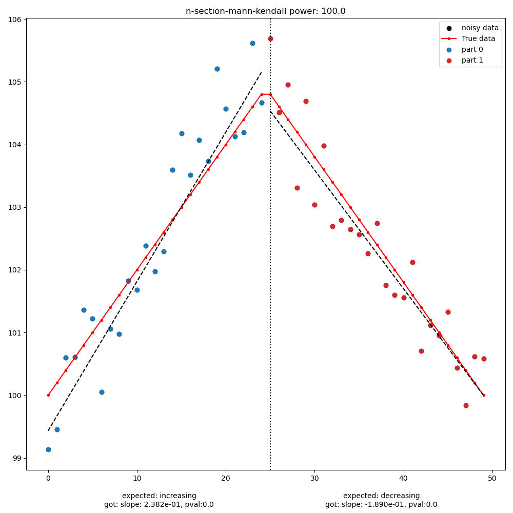
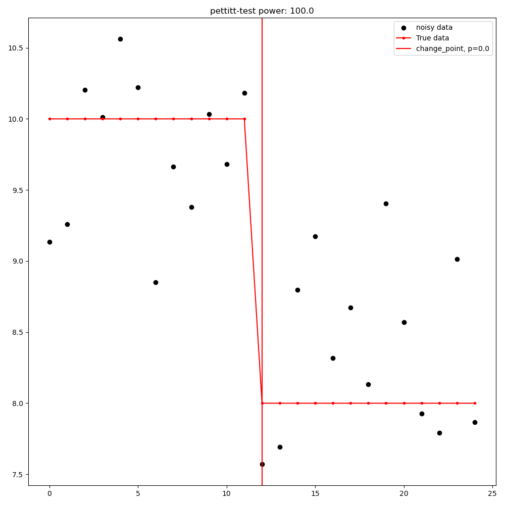

Groundwater Detection Power Calculator
#######################################

This package is designed to calculate the statistical power of detecting a change in groundwater/surface concentration
depending on sampling duration, sampling frequency, 'true' receptor concentration and the noise in the receptor.
there is also support for understanding statistical power in the context of groundwater travel times (e.g. lag)
and groundwater temporal dispersion (e.g. mixing of different aged waters via a binary piston flow lag model).

.. contents:: Table of Contents
    :depth: 3

Key definitions
==================

In this repo we have a couple key definitions:

* **Receptor**: The receptor is the location where the concentration is measured.  This is typically a groundwater well, stream or lake.
* **Source**: The source is the location where the concentration is changed.  This is typically a point source (e.g. a wastewater treatment plant) or a non-point source (e.g. a catchment/groundwater source area).
* **Noise**: here by noise we include the variation in the concentration at the receptor. This includes true sampling noise, but also includes any other variation in the concentration at the receptor that cannot be identified or corrected for (e.g. from weather events etc.). Typically the noise will be estimated as the standard deviation of the receptor concentration time series (assuming no trend), or the standard deviation of the residuals from a model (e.g. linear regression) of the receptor concentration time series.
* **True Receptor Concentration**: The true receptor concentration is the concentration at the receptor if there was no noise.

High Level suggested detection power methodology
=================================================

The suggested methodology for calculating the detection power of a site is as follows:

1. Access and review the historical concentration data and review and potentially remove outliers
2. (optional) if possible you may deconstruct the historical data to remove influences of seasonal/annual/inter-annual cycles, weather events etc.
3. Ascertain whether or not the historical concentration data has a statistically robust trend (e.g. via a Mann-Kendall test)
4. Estimate the noise in the receptor concentration time series
   a. If the historical concentration data has a statistically robust trend, then the noise can be estimated as the standard deviation of the residuals from a model (e.g. a linear regression or Sen-slope/ Sen-intercept).
   b. If the historical concentration data does not have a statistically robust trend, then the noise can be estimated as the standard deviation of the receptor concentration time series.
5. Gather data to inform the groundwater age distribution of the site.  For instance a MRT and parameters for a binary piston flow lag model.
6. Estimate the source concentration from the historical trend (if any) and the groundwater age distribution for instance using the `gw_detect_power.truets_from_binary_exp_piston_flow function <https://github.com/Komanawa-Solutions-Ltd/gw_detect_power#id7>`_ or the `gw_age_tools.predict_historical_source_conc function <https://github.com/Komanawa-Solutions-Ltd/gw_age_tools#predict-historical-source-conc>`_.
7. Define the reduction expected in the source concentration over the implementation period to create a "once and future source concentration time series".
8. Predict the true receptor concentration time series (e.g. the concentration at the receptor if there was no noise) based on the "once and future source concentration time series" and the groundwater age distribution e.g., using `gw_age_tools.predict_future_conc_bepm function <https://github.com/Komanawa-Solutions-Ltd/gw_age_tools#predict-historical-source-conc>`_.
9. Resample the true receptor concentration time series to the desired sampling frequency and duration.
10. Estimate the statistical power of detecting the change in concentration based on the predicted true receptor concentration time series and the noise in the receptor concentration time series.  This can be done using the `gw_detect_power.power_calc function <https://github.com/Komanawa-Solutions-Ltd/gw_detect_power#id8>`_ and `pass your own true receptor time series option <https://github.com/Komanawa-Solutions-Ltd/gw_detect_power#pass-your-own-true-receptor-time-series>`_.

Note that items 6-10 are implemented in the `gw_detect_power.power_calc function <https://github.com/Komanawa-Solutions-Ltd/gw_detect_power#id8>`_ if mrt_model='binary_exponential_piston_flow'; however if you have many iterations to run, saving the true receptor concentration time series, resampling it, and passing it to the power_calc function will significantly reduce the computational resource requirements.

Look up tables for statistical power
=====================================

We have included a number of lookup table to support less computationally savvy users. These look up tables are here to give estimates of the detection power.

These tables have been run for a no lag scenario with:

* 5, 10, 20, 30, 50, 75, & 100 year implementation times
* 5, 10, 15, 20, 25, 30 & 50 year monitoring durations
* 1, 4, 12, 26 & 52 samples/year sampling frequencies
* 0.05, 0.1, 0.2, 0.3, 0.4, 0.5, 0.75, 1.0, 1.5, 2, 2.5, 3, 4, 5, & 7.5 mg/l N-NO3 Noise levels
* 4, 5.6, 6, 7, 8, 9, 10, 11.3, 15 & 20 mg/l starting N-NO3 concentrations
* 5, 10, 15, 20, 25, 30, 40, 50 & 75% reductions in N-NO3 concentrations over the implementation period

The piston flow lag includes mean residence times of 1, 3, 5, 7, 10, 12, 15 years.

To use these tables:

1. Locate and download the right table (decision tree):
    1. `if you are not interested in the effect of lag <lookup_tables/no_lag_table.xlsx>`_
    2. if you are interested in the effect of lag, then download the table for the appropriate implementation time:
        * `5 year implementation time <lookup_tables/piston_flow_lag_table_imp_5.xlsx>`_
        * `10 year implementation time <lookup_tables/piston_flow_lag_table_imp_10.xlsx>`_
        * `20 year implementation time <lookup_tables/piston_flow_lag_table_imp_20.xlsx>`_
        * `30 year implementation time <lookup_tables/piston_flow_lag_table_imp_30.xlsx>`_
        * `50 year implementation time <lookup_tables/piston_flow_lag_table_imp_50.xlsx>`_
        * `75 year implementation time <lookup_tables/piston_flow_lag_table_imp_75.xlsx>`_
        * `100 year implementation time <lookup_tables/piston_flow_lag_table_imp_100.xlsx>`_
2. open the table in a spreadsheet program (e.g. excel)
3. Locate the row that corresponds to the closest:
    * sampling duration (samp_years)
    * sampling frequency (samp_per_year)
    * implementation_time
    * initial_conc
    * target_conc
    * percent_reduction
    * mean residence time (mrt (if applicable))
4. The provided power is the percent chance of detecting the change in concentration

Dependencies
==================

* pandas>=2.0.3
* numpy>=1.25.2
* scipy>=1.11.2
* tables>=3.8.0
* psutil>=5.9.5

Optional Dependencies
----------------------

* pyhomogeneity (for the Pettitt test)
* kendall_stats (for the Mann Kendall / MultiPart Mann Kendall / Multipart Seasonal Mann Kendall)
* gw_age_tools (for the binary piston flow lag)

Installation
==================

This package is currently held as a simple github repo,
but the intention is to make it available on PyPI in the future, It also sources other repos that are only hosted on
github.  Therefore, the easiest way to install is to use pip and install directly from github.  This will ensure that
all dependencies are installed.

Install from Github
----------------------

.. code-block:: bash

    conda create -c conda-forge --name gw_detect  python=3.11 pandas=2.0.3 numpy=1.25.2 matplotlib=3.7.2 scipy=1.11.2 pytables=3.8.0 psutil=5.9.5
    conda activate gw_detect

    pip install pyhomogeneity
    pip install git+https://github.com/Komanawa-Solutions-Ltd/kendall_multipart_kendall.git
    pip install git+https://github.com/Komanawa-Solutions-Ltd/gw_age_tools
    pip install git+https://github.com/Komanawa-Solutions-Ltd/gw_detect_power

Methodology
================

The statistical power calculation is fairly straight forward.  the steps are:

1. Create a 'True' receptor time series (e.g. the concentration at the receptor/well if there was no lag)
2. Generate noise based on the user passed standard deviation ('error' kwarg).  A normal distribution is used.
3. Add the noise to the true receptor time series
4. Assess the significance of the noisy receptor time series.
5. If the change is statistically significant (p< minimum p value) and in the expected direction, then the detection power is 1.0, otherwise it is 0.0
6. Repeat steps 2-5 for the number of iterations specified by the user ('n_iterations' kwarg) the statistical power is then reported as the mean of the detection power over the number of iterations (as a percentage).

Options to create the 'True' receptor time series
-------------------------------------------------------

We have implemented four different options to create the 'True' receptor time series.  These are:

* Simple linear reductions between initial and target concentration
* Simple linear reductions concentration with a Piston Flow lag with a positive, negative, or no previous slope (see 'true_ts_from_piston_flow' function)
* Simple linear reductions with an single or binary exponential piston flow lag with a positive or no previous slope (see 'truets_from_binary_exp_piston_flow' function)

Pass your own True receptor time series
^^^^^^^^^^^^^^^^^^^^^^^^^^^^^^^^^^^^^^^^^^

the user is able to pass a bespoke receptor time series to the function. This is done by passing a numpy array to the 'true_conc_ts' kwarg, mrt_model='pass_true_conc'. All other kwargs except 'idv', and 'error' must be set as None. The sampling rate will be assumed to be the same as the passed receptor concentration.  That is a true_conc_ts with 20 values will have the randomly generated error added to each value and then be assessed for statistical power. An example of this behaviour is show in the figure below.

.. figure:: figures/linear-regression_iteration.png
   :height: 500 px
   :align: center

Options to assess the significance of the noisy receptor time series
--------------------------------------------------------------------------

These are listed in the order of increasing computational cost.

* Linear regression from the first point to the last point (detection is a significant slope in the expected direction)
* Linear regression from the [max|min] point to the last point (detection is a significant slope in the expected direction)
* Mann-Kendall test from the first point to the last point (requires kendall_stats optional dependency) (detection is a significant slope in the expected direction)
* Mann-Kendall test from the [max|min] point to the last point (requires kendall_stats optional dependency) (detection is a significant slope in the expected direction)
* MultiPart Mann Kendall/Multipart Seasonal Mann Kendall (requires kendall_stats optional dependency) here if the process identifies any significant breakpoints (within the alpha, no_trend_alpha, and expected slopes) the test records detection. See `kendall_stats <https://github.com/Komanawa-Solutions-Ltd/kendall_multipart_kendall#multipartkendall>`_ for more details

Pettitt test (requires pyhomogeneity optional dependency)
^^^^^^^^^^^^^^^^^^^^^^^^^^^^^^^^^^^^^^^^^^^^^^^^^^^^^^^^^^^^^

The pettitt test is much better a identifying step changes in the data rather than slow decreases in concentration.
This can cause unexpected behaviour as compared to the other change detection tests. As an example see the
figure below:

Based on this we do not suggest using the Pettitt test in conjunction with the lag models, which are designed to
identify slow decreases in concentration.  However, the Pettitt test is included for completeness.

Note that the pettit test requires an additional parameter nsims_pettit.  This is the number of simulations to run to estimate the p value.  The default is 2000, but this can be increased to improve the accuracy of the p value or decreased to reduce the computational burden. in support the run times of a single pettitt test (recall it will be run self.nsims times) is shown below:

* 2 pettitt simulations: 8.0e-4 seconds
* 20 pettitt simulations: 3.0e-3 seconds
* 200 pettitt simulations: 2.5e-2 seconds
* 2000 pettitt simulations: 2.4e-1 seconds
* 20000 pettitt simulations: 2.5 seconds

the effect on the pvalue is shown in the figure below:

Python Package Usage
======================

Detailed documentation is available in the docstrings of the functions and classes.
The following is a brief overview of the package.

Detection power class initialisation
-----------------------------------------------------

.. code-block::python

    from gw_detect_power import DetectionPowerCalculator
    import logging

    dpc = DetectionPowerCalculator(
        significance_mode='linear-regression', nsims=1000, min_p_value=0.05, min_samples=10,
        expect_slope='auto', # usage depends on significance_mode
        # kwargs only for significance_mode='n-section-mann-kendall'
        nparts=None, min_part_size=10, no_trend_alpha=0.50,
        # kwargs only for significance_mode='pettitt-test'
        nsims_pettit=2000,
        # kwargs used for multiprocessing
        ncores=None, log_level=logging.INFO,
        # power_calc return options
        return_true_conc=False, return_noisy_conc_itters=0)

truets_from_piston_flow function
-----------------------------------------------------

This function provides a simple way to generate a true receptor time series with a piston flow lag.  An example follows, for more details see the docstring. Note that there is no mixing of different aged water in this model.

.. code-block::python

    import matplotlib.pyplot as plt
    import numpy as np
    from gw_detect_power import DetectionPowerCalculator

    dpc = DetectionPowerCalculator()
    output = dpc.truets_from_piston_flow(mrt=12, initial_conc=5, target_conc=2.4,
                                prev_slope=1, max_conc=15, samp_per_year=4, samp_years=20,
                                    implementation_time=5)
    true_conc_ts=output[0]
    max_conc = output[1]
    max_conc_time=output[2]
    frac_p2=output[3] # dummy value
    fig, ax = plt.subplots(figsize=(5,5))
    ax.plot(np.arange(len(true_conc_ts))/4, true_conc_ts, label='true conc', marker='.')
    ax.axvline(max_conc_time, color='k', linestyle='--', label='max conc time')
    ax.axhline(max_conc, color='k', linestyle=':', label='max conc')
    ax.set_xlabel('time years')
    ax.set_ylabel('concentration')
    ax.legend()
    fig.tight_layout()
    plt.show()

truets_from_binary_exp_piston_flow function
-----------------------------------------------------

This function provides an easy method to generate true receptor time series from a binary exponential piston flow lag model.  An example follows, for more details see the docstring and see the `gw_age_tools repo <https://github.com/Komanawa-Solutions-Ltd/gw_age_tools>`_ for more details on the binary exponential piston flow lag model.

.. code-block:: python

    import matplotlib.pyplot as plt
    import numpy as np

    from gw_detect_power import DetectionPowerCalculator

    dpc = DetectionPowerCalculator()
    output = dpc.truets_from_binary_exp_piston_flow(mrt=15,
                                                    mrt_p1=10,
                                                    frac_p1=0.7,
                                                    f_p1=0.7, f_p2=0.5,
                                                    initial_conc=5.6, target_conc=2.4,
                                                    prev_slope=0.5,
                                                    max_conc=20,
                                                    min_conc=1,
                                                    samp_per_year=4, samp_years=30,
                                                    implementation_time=5, past_source_data=None,
                                                    return_extras=False, low_mem=False,
                                                    precision=2)

    true_conc_ts = output[0]
    max_conc = output[1]
    max_conc_time = output[2]
    frac_p2 = output[3]  # dummy value
    fig, ax = plt.subplots(figsize=(5, 5))
    ax.plot(np.arange(len(true_conc_ts)) / 4, true_conc_ts, label='true conc', marker='.')
    ax.axvline(max_conc_time, color='k', linestyle='--', label='max conc time')
    ax.axhline(max_conc, color='k', linestyle=':', label='max conc')
    ax.set_xlabel('time years')
    ax.set_ylabel('concentration')
    ax.legend()
    fig.tight_layout()
    plt.show()
    plt.close(fig)

power_calc function
-----------------------------------------------------

The power calc function is the base function for the DetectionPowerCalculator class. An example follows, for more details see the docstring.

.. code-block:: python

    from gw_detect_power import DetectionPowerCalculator

    dpc = DetectionPowerCalculator()
    out = dpc.power_calc(idv='true',
                   error=0.5,
                   mrt_model='binary_exponential_piston_flow',
                   samp_years=10,
                   samp_per_year=10,
                   implementation_time=5,
                   initial_conc=10,
                   target_conc=5,
                   prev_slope=1,
                   max_conc=25,
                   min_conc=1,
                   mrt=5,
                   #
                   mrt_p1=3,
                   frac_p1=0.7,
                   f_p1=0.7,
                   f_p2=0.7,
                   #
                   true_conc_ts=None,
                   seed=558)

Output (pd.Series)

>>> idv                                              true
>>> power                                           100.0
>>> max_conc                                    11.644864
>>> max_conc_time                                     2.3
>>> error                                             0.5
>>> mrt_model              binary_exponential_piston_flow
>>> samp_years                                         10
>>> samp_per_year                                      10
>>> implementation_time                                 5
>>> initial_conc                                       10
>>> target_conc                                         5
>>> previous_slope                                      1
>>> max_conc_lim                                       25
>>> min_conc_lim                                        1
>>> mrt                                                 5
>>> mrt_p1                                              3
>>> frac_p1                                           0.7
>>> f_p1                                              0.7
>>> f_p2                                              0.7
>>> seed                                              558
>>> mrt_p2                                       9.666667
>>> python_error                                     None
>>> dtype: object

plot_iteration function
-----------------------------------------------------

We have provided a simple function to plot a single iteration of the power calculation.  This function is called DetectionPowerCalculator.plot_iteration it is based on the power_calc function, but only runs a single iteration. The run is for a single threaded process only.  An example follows.  Example plots are available in the example plots section below.

.. code-block:: python

    dp = DetectionPowerCalculator(significance_mode='mann-kendall', expect_slope='auto', nsims=100,
                                      nparts=None, return_true_conc=True,
                                      return_noisy_conc_itters=1)
    output = dp.power_calc(idv=mode, error=0.5, true_conc_ts=data, mrt_model='pass_true_conc')
    fig, ax = dp.plot_iteration(output['noisy_conc'].iloc[:, 0], output['true_conc'])
    ax.set_title(f'{mode} power: {output["power"]["power"]}')
    fig.tight_layout()
    plt.show()

time_test_power_calc_itter function
-----------------------------------------------------

Depending on the methodology used power calculations can take a significant amount of time. Therefore we have provided
a function to quickly estimate the time a given power calculation will take.  This function is called DetectionPowerCalculator,time_test_power_calc_itter it is based on the power_calc function, but only runs a user specified number of iterations (instead of DetectionPowerCalculator.nsims, default=10). The run is for a single threaded process only.

usage is as follows:

.. code-block:: python

    from gw_detect_power import DetectionPowerCalculator

    dpc = DetectionPowerCalculator(
        significance_mode='n-section-mann-kendall', nsims=1000,
        expect_slope=[1, 0, -1], nparts=3, min_part_size=10, no_trend_alpha=0.50,
        return_true_conc=True, return_noisy_conc_itters=3)

    dpc.time_test_power_calc_itter(
               testnitter=5, # only run 5 change detection iterations instead of 1000 as per dpc.nsims
               # all the following are kwargs for the DetectionPowerCalculator.power_calc function
               idv='true',
               error=error_val,
               mrt_model='binary_exponential_piston_flow',
               samp_years=samp_years,
               samp_per_year=10,
               implementation_time=5,
               initial_conc=10,
               target_conc=5,
               prev_slope=1,
               max_conc=25,
               min_conc=1,
               mrt=5,
               #
               mrt_p1=3,
               frac_p1=0.7,
               f_p1=0.7,
               f_p2=0.7,
               #
               true_conc_ts=None,
               seed=558
    )

output:

>>> "time per iteration: 0.15203397274017333 s. based on 10 iterations"
>>> "with set number of iterations: 1000 it will take 2.5338995456695557 s to run the power calc"

mulitprocess_power_calcs
-----------------------------------------------------

As specified before detection power calculations can take a significant amount of time, particularly if the user is using a more computationally intensive methodology (e.g. the Pettitt test or multipoint mann kendall tests).  Therefore we have provided a function to run multiple power calculations in parallel.  This function is called DetectionPowerCalculator.mulitprocess_power_calcs it is based on the power_calc function, but runs multiple power calculations in parallel. An example of its use is shown below:

Note that the outputs include a 'python_error' column which contains the traceback for any errors that occur during the power calculation.  This is useful for debugging.

.. code-block:: python

    from gw_detect_power import DetectionPowerCalculator

    dpc = DetectionPowerCalculator(
        significance_mode='mann-kendall', nsims=1000,
        expect_slope='auto',
        ncores=3,  # maximum number of cores to use
        return_true_conc=True, return_noisy_conc_itters=3
        # even though these are set, the true and noisy concs are not returned for multiprocessing runs
    )

    id_vals = []
    error_vals = []
    samp_years_vals = []
    implementation_time_vals = []

    # build runs
    for error in [0.5, 1]:
        for samp_years in [10, 20, 30]:
            for imp_year in [5, 10]:
                id_vals.append(f'{error}_{samp_years}_{imp_year}')
                error_vals.append(error)
                samp_years_vals.append(samp_years)
                implementation_time_vals.append(imp_year)

    dpc.mulitprocess_power_calcs(
        outpath=None,  # don't save the output
        id_vals=id_vals,
        error_vals=error_vals,
        samp_years_vals=samp_years_vals,
        samp_per_year_vals=12,  # use monthly sampling frequency for all runs
        implementation_time_vals=implementation_time_vals,
        initial_conc_vals=6,  # use 6 mg/l as the initial concentration for all runs
        target_conc_vals=2.4,  # use 2.4 mg/l as the target concentration for all runs
        previous_slope_vals=0,
        max_conc_vals=25,
        min_conc_vals=1,
        mrt_model_vals='binary_exponential_piston_flow',
        mrt_vals=10,
        mrt_p1_vals=10,
        frac_p1_vals=1,
        f_p1_vals=0.7,
        f_p2_vals=0.7,  # dummy value as frac_p1_vals=1
        true_conc_ts_vals=None,
        seed=5585,
        run=True,  # if run=False, the power calculations will not be run, but the kwargs will be returned it is useful to
        # set run=False when testing the kwargs before a large run.
    )

Resource Requirements
=======================

The Detection power calculator can use substantial resources depending on the number of iterations and the significance mode used. In general the significance mode efficiency is as follows:

1. Linear regression based techniques
2. Mann-Kendall based techniques
3. Pettitt test
4. MultiPart Mann-Kendal

We have implemented an efficiency mode to decrease the computational resource requirements. The effect of the mode depends on the significance test

For linear regression and Mann-Kendall techniques the efficiency mode first calculates the pvalue and sign for the true (noise free) concentration time series. If the pvalue is greater than the minimum pvalue then the power is set to 0.0 and the power calculations are not run on the noisy concentration time series.  This can significantly decrease the computational resource requirements.

For the MultiPart Mann-Kendall efficiency mode both calculates the trend detection on the true time series (and then returns a power of 0 if the trend is not detected) and reduces the number of possible breakpoints that are assessed by creating a possible window to test each breakpoint. This window is defined by the maximum of:

* the minimum number of breakpoints to test (mpmk_efficent_min)
* or as a fraction of the length of the full time series (mpmk_window).

Note that you can also and independently set the step size of the breakpoints (mpmk_check_step) (e.g a step size of 1 will test every possible breakpoint, a step size of 2 will test every second breakpoint etc.).  For more information see the docstring, the docstring of the MultiPartMannKendall class, and the `kendall_stats repo <https://github.com/Komanawa-Solutions-Ltd/kendall_multipart_kendall>`_. Where both a mpmk_window and a check_step>1 is passed the mpmk_window will be used to define the window size and the check_step will be used to define the step size within the window. The minimum number of breakpoints to test (mpmk_efficent_min) is always respected (i.e. if the window size is less than the minimum number of breakpoints to test, then the window size will be increased to the minimum number of breakpoints to test, but the space between breakpoints will still be defined by check_step).

For the Pettitt test the efficiency mode is not yet implemented.

Memory Requirements
----------------------
For linear regression techniques the memory requirement is relatively minor

For mann-kendall techniques the memory requirement is proportional to the number of samples in the time series. For all Mann-Kendall techniques the program must calculate the "s_array" which is the difference between all pairs of samples.  The s_array is a square matrix with the number of rows and columns equal to the number of samples in the time series.  Therefore the memory requirement is:

* N: 4 * s_array memory
* 50: 8e-05 gb
* 100: 0.00032 gb
* 500: 0.008 gb
* 1,000: 0.032 gb
* 5,000: 0.8 gb
* 10,000: 3.2 gb
* 25,000: 20.0 gb
* 50,000: 80.0 gb

We have not assessed the Pettitt test memory requirements.

Example Runtimes
----------------------

The following table shows the run time for a single iteration of the power calculation for each significance mode.  Note that the resource requirements are for a single threaded process. The table of processing times was run on a single thread (11th Gen Intel(R) Core(TM) i5-11500H @ 2.90GHz with 32 GB of DDR4 RAM). The results are in seconds.  For these tests we set the following variables:

.. code-block:: python

    # constants
    nsims = 10
    mpmk_check_step = 1
    mpmk_efficent_min = 10
    mpmk_window = 0.05
    nsims_pettit = 2000

    # iterables
    methods = DetectionPowerCalculator.implemented_significance_modes
    ndata = [50, 100, 500, 1000, 5000]
    efficency_modes = [True, False]

If you want a processing time table for a different machine run:

.. code-block:: python

    from pathlib import Path
    from gw_detect_power.timetest import timeit_test
    data = timeit_test()
    data.to_csv(Path.home().joinpath('Downloads', 'timeit_test_results.txt'))

Note that this may take some time

linear regression techniques
^^^^^^^^^^^^^^^^^^^^^^^^^^^^^^^

+--------+-------------------+----------------------------+----------------------------+
| n data | linear-regression | linear-regression-from-max | linear-regression-from-min |
+========+===================+============================+============================+
| 50     | 1.01E-03          | 8.62E-04                   | 8.33E-04                   |
+--------+-------------------+----------------------------+----------------------------+
| 100    | 1.03E-03          | 8.91E-04                   | 8.74E-04                   |
+--------+-------------------+----------------------------+----------------------------+
| 500    | 1.28E-03          | 1.11E-03                   | 9.72E-04                   |
+--------+-------------------+----------------------------+----------------------------+
| 1000   | 1.26E-03          | 1.10E-03                   | 1.10E-03                   |
+--------+-------------------+----------------------------+----------------------------+
| 5000   | 2.69E-03          | 2.03E-03                   | 2.01E-03                   |
+--------+-------------------+----------------------------+----------------------------+

Mann-Kendall Techniques
^^^^^^^^^^^^^^^^^^^^^^^^^^^^^^^

+--------+--------------+-----------------------+-----------------------+
| n data | mann-kendall | mann-kendall-from-max | mann-kendall-from-min |
+========+==============+=======================+=======================+
| 50     | 3.45E-03     | 3.26E-03              | 3.20E-03              |
+--------+--------------+-----------------------+-----------------------+
| 100    | 3.82E-03     | 3.32E-03              | 3.33E-03              |
+--------+--------------+-----------------------+-----------------------+
| 500    | 1.27E-02     | 5.70E-03              | 5.44E-03              |
+--------+--------------+-----------------------+-----------------------+
| 1000   | 5.82E-02     | 1.31E-02              | 1.25E-02              |
+--------+--------------+-----------------------+-----------------------+
| 5000   | 1.58E+01     | 1.79E+00              | 1.79E+00              |
+--------+--------------+-----------------------+-----------------------+

MultiPart Mann-Kendall / Pettitt test
^^^^^^^^^^^^^^^^^^^^^^^^^^^^^^^^^^^^^^

+--------+----------------+------------------------+--------------+
| n data | efficency_mode | n-section-mann-kendall | pettitt-test |
+========+================+========================+==============+
| 50     | True           | 5.71E-02               | na           |
+--------+----------------+------------------------+--------------+
| 50     | False          | 9.27E-02               | 8.91E-01     |
+--------+----------------+------------------------+--------------+
| 100    | True           | 6.92E-02               | na           |
+--------+----------------+------------------------+--------------+
| 100    | False          | 2.38E-01               | 9.36E-01     |
+--------+----------------+------------------------+--------------+
| 500    | True           | 3.95E-01               | na           |
+--------+----------------+------------------------+--------------+
| 500    | False          | 1.80E+00               | 1.35E+00     |
+--------+----------------+------------------------+--------------+
| 1000   | True           | 1.22E+00               |  na          |
+--------+----------------+------------------------+--------------+
| 1000   | False          | 5.91E+00               | 1.83E+00     |
+--------+----------------+------------------------+--------------+
| 5000   | True           | 1.21E+02               |  na          |
+--------+----------------+------------------------+--------------+
| 5000   | False          | 5.47E+02               | 5.88E+00     |
+--------+----------------+------------------------+--------------+

Example plots for each significance mode
===========================================

Linear Regression from first point to last point
-----------------------------------------------------

.. figure:: figures/linear-regression_iteration.png
   :height: 500 px
   :align: center

Linear Regression from [max|min] point to last point
-----------------------------------------------------

.. figure:: figures/linear-regression-from-min_iteration.png
   :height: 500 px
   :align: center

.. figure:: figures/linear-regression-from-max_iteration.png
   :height: 500 px
   :align: center

Mann-Kendall test from first point to last point
-----------------------------------------------------

Mann-Kendall test from [max|min] point to last point
-----------------------------------------------------

.. figure:: figures/mann-kendall-from-max_iteration.png
   :height: 500 px
   :align: center

MultiPart Mann Kendall test
-----------------------------------------------------

Pettitt test
-----------------------------------------------------

Further Improvements
======================

if time/interest allows we would like to implement the following improvements:

* implement a paired t-test for a counter factual approach

If you have any suggestions for improvements please let us know by raising an issue on the github repo.